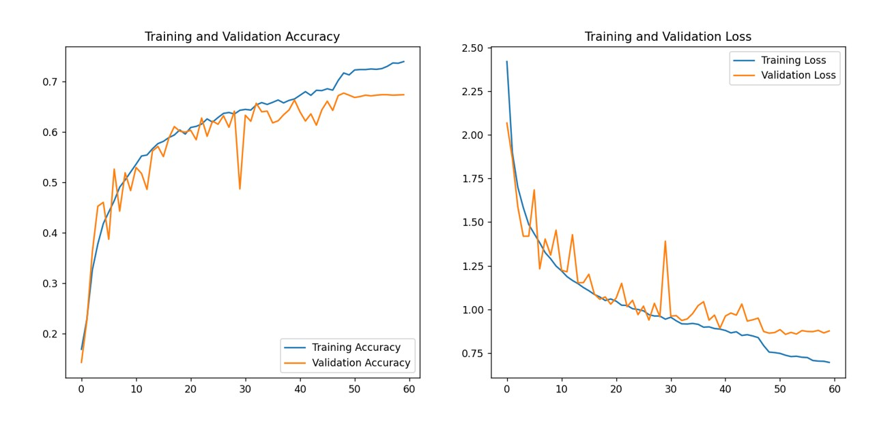

# FER and FD
A program that combines the use of facial detection and facial expression recognition to try to find all faces in a provided image and classify them into any of these 7 categories:
* Anger
* Happy
* Sad
* Fear 
* Neutral
* Disgust
* Surprise

In the proccess it is able to provide an enjoyable exprerience, as well as a learning ground for anyone looking to delve into one of the most important parts of **Machine and Deep Learning**, that being **Convolution Nural Networks** (CNN).

The idea and pipeline of this program is actually quite simple. What we want is 2 things:
* Being able to receive any image, whether that would be from a camera, a saved photo or any other means, and be able to detect all the faces present in that image and outline them with a bounding box
* Being able to extract key facial feautures using our CNN to deduce the facial expressions of all the faces found in the previous step

## Facial Detection
For the facial detection part of this project I took advantage of the speed and accuracy that the YOLOv8 nano model provides, training it with a significant amount of data so that it is able to give us incredible results.
The files used are `fd_data_prep.py`,`fd_training.py` and `yolov8_config.yaml`. Out of those 2 the most interesting one is the first, since it shows how the data was extracted and proccesed in order to be fed to our model in the training step. As the name implies the second file contains the training proccess of the model and the last file is simply used by the YOLOV8 model to 1) Locate the data and 2) Know how many objects it has to learn to classify, since YOLOV8 is used for Object Detection and not just Facial Detection. 

## Facial Expression Recognition
This part is without a doubt the most impressive and fun of the entire project! The files used are `fer_data_prep` which provides functions for data proccessing and loading, `fer_model_architecture` which shows what my model architecture is, and `fer_training` which works as a main file combining the other 2 and using all that they provide to create and train a facial expression recognition model. The model architecture I used
is the one presented in the `4.Dr.NVN FERNet.pdf` file with slight modification to the training proccess, hyperparameters and the removal of CNN block. The provided model `models/aff_model_test_2.keras` boasts a really good performance of **68% accuracy**, which is on par with other architectures of similar nature.
Provided below is the **accuracy and loss graph** that corresponds to my model:

## Datasets
The datasets used are:
* A combination of WIDERFACE, FDDB and LFPW for FD
* AffectNet for FER
both of which can be found in the links provided in the `datasets.txt` file.

## Things To Note
* A result of 0.68 may seem fairly low, however the reason for that is not the architecture but the data provided. AffectNet is a dataset with pretty clean data ,however it has a lot of variety in order to better generalize thus dropping its accuracy. Another dataset that suffers the same, if not a worse fate is the popular fer2013 dataset which contains A LOT of muddy images such as cartoon faces, images with watermarks and even exagerated depections of expressions such as fire exiting a persons nose when he is mad. Obviously we humans have no problem classifying an expression even under such circumstances, however the computer isn't as lucky and capable, that's why we have to teach it that those red hairing dont really matter!  

* I noticed that the learning rate and even the padding may have to be changed deopending on the cpu or gpu you are using to train the model. (on google colab a learning rate of 0.000005 was needed for accuracy to start increasing, whereas in my computer 0.0005 gets the job done)

* Finally i would really recommend reading the `4.Dr.NVN FERNet` paper since, as a beginner, I found it to be incredibly insightful and helpful. 
